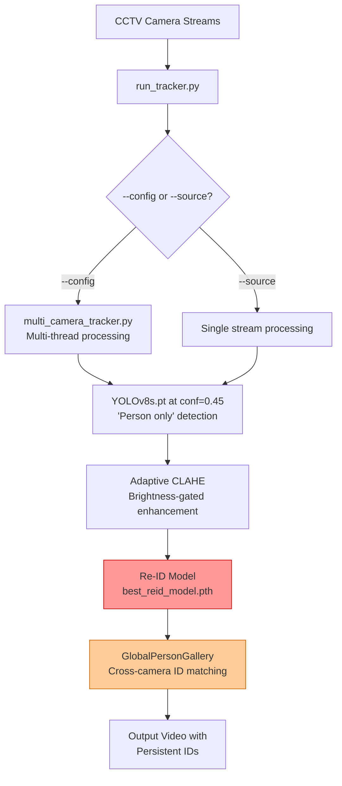

# 🧠 Persona Detection Project — Full Analysis

> Based on deep analysis of `antigravity_chat_5.txt` (5,888 lines), all project files, and previous conversation history.

---

## 📁 Repository Overview

**Location:** `c:\Users\ADMIN\Downloads\persona-detection-main`  
**Training PC Location:** `F:\persona-detection-main` (separate machine)  
**GPU:** NVIDIA GeForce RTX 4070 (12 GB VRAM)  
**Goal:** Multi-camera CCTV person detection + Re-Identification (Re-ID) pipeline with day/night adaptability.

---

## ✅ What Has Been Completed

### Phase 1 — YOLO Detection (DONE ✅)

| Item | Status | Detail |
|------|--------|--------|
| Dataset download | ✅ Complete | COCO2017 (D:\), CrowdHuman, WiderPerson, CityPersons, NightOwls (E:\) |
| COCO → YOLO conversion | ✅ Done | `convert_coco_yolo.py` ran on Training PC |
| NightOwls → YOLO conversion | ✅ Done | `convert_coco_yolo.py` with `nightowls_training.json` |
| Balanced merge | ✅ Done | `balanced_merge.py --cap-day 22179` (1:1 ratio) |
| YOLO fine-tuning | ✅ Complete | 50 epochs on RTX 4070 — `best.pt` = 21 MB (stripped), saved at `F:\persona-detection-main\runs\detect\yolov8s_rot0\weights\best.pt` |
| Training validation | ✅ Confirmed | Epoch 1 mAP=0.66, Epoch 4 still improving — normal warmup shock |

### Phase 1 — Key Discovery (Game Changer)
> **`yolov8s.pt` with `conf=0.45` eliminates bike false-positives AND still detects all real people.**
> This means the overnight retraining runs (A/B/C) are **not required** for functional deployment.

### Validation Sweep (Colab) — DONE ✅
- NightOwls validation data (~26,595 images) downloaded and converted to pedestrian-only YOLO format
- 18-parameter sweep run (conf × iou × imgsz)
- **Best config found:** `conf=0.25`, `imgsz=640` (metric-based) or `conf=0.45` (empirically, from visual CCTV test)

### Phase 2 — Re-ID Model (PARTIALLY DONE ⚠️)

| Item | Status | Detail |
|------|--------|--------|
| `best_reid_model.pth` trained | ✅ | 282 MB, 40 epochs, saved in `phase2_reid/checkpoints/` |
| `evaluate_reid.py` fixed | ✅ | LaST flat-layout bug fixed, graceful error on empty loader |
| Evaluation ran on all epochs | ✅ | Market-1501, MSMT17, LaST all evaluated |

#### Re-ID Evaluation Results (Latest Session)

| Dataset | Best Epoch | mAP | Rank-1 | Rank-5 | Rank-10 |
|---------|-----------|-----|--------|--------|---------|
| Market-1501 | Epoch 20 | 27.02 | **43.62%** | 68.79% | 77.64% |
| MSMT17 | Epoch 20 | 12.26 | **42.51%** | 63.06% | 70.66% |
| LaST | Epoch 20 | 2.56 | **7.71%** | 18.02% | 24.52% |

> ⚠️ **Production requirement is Rank-1 > 85%.** Current model is stuck at ~43%.

### Phase 3 — Tracking Integration (PARTIALLY DONE ✅)

| Item | Status |
|------|--------|
| `multi_camera_tracker.py` upgraded | ✅ Adaptive CLAHE, day/night model switching (currently commented out/reserved) |
| `run_tracker.py` upgraded | ✅ `--day-model`, `--night-model`, `--yolo-model` flags; `conf` default changed to 0.45 |
| `REQUIREMENTS.md` updated | ✅ Hardware specs documented |
| `train_overnight.ps1` created | ✅ 3 training configs (A/B/C) queued |

---

## 🔴 What Is NOT Yet Done

### 1. Re-ID Needs Major Improvement
The current Re-ID model hits only **43.62% Rank-1** on Market-1501. Production needs **>85%**.

**Root causes identified at end of chat_5:**
- **Static Triplet Problem** — model sees same negatives repeatedly, stops learning
- **Missing ID Classification Loss** — needs Triplet + Cross-Entropy combined loss
- **Domain Clash** — mixing Market1501 + MSMT17 + LaST causes destructive interference

**Two paths forward (unchoosen at end of chat):**
- **Option A:** Rewrite `train_reid_multi.py` with PKSampler + CrossEntropy head
- **Option B:** Use pre-trained OSNet / FastReID (industry standard, 90%+ Rank-1 immediately)

### 2. End-to-End Multi-Camera Test Not Run Yet
- `cameras_example.json` exists but has NOT been used yet with `--config` flag
- True cross-camera Re-ID matching has not been validated
- This is the **ultimate final test** of the system

### 3. Overnight Training Runs (A/B/C) — Optional Now
- Created in `train_overnight.ps1` but may not be needed if `conf=0.45` is accepted
- If user wants better nighttime Recall (detecting more people at lower confidence), these are needed.

---

## 🗺️ File Map — Where Everything Lives

```
persona-detection-main/
├── multi_camera_tracker.py     ← Core tracker (upgraded with CLAHE + model switching)
├── run_tracker.py              ← CLI entry point (now has --day-model, --yolo-model, --conf=0.45)
├── yolov8s.pt                  ← Generic daytime YOLO base model
├── phase2_reid/
│   ├── checkpoints/best_reid_model.pth    ← Trained Re-ID weights (43% Rank-1)
│   ├── train_reid_multi.py     ← Re-ID training (needs upgrade)
│   ├── evaluate_reid.py        ← Evaluation (fixed)
│   └── datasets/last.py        ← LaST loader (fixed for flat layout)
├── training_scripts/
│   ├── balanced_merge.py       ← Dataset merger (--cap-day implemented)
│   ├── convert_coco_yolo.py    ← COCO/NightOwls JSON → YOLO format
│   ├── train_yolo.py           ← YOLO fine-tuning (--freeze, --lr0, --batch flags)
│   ├── yolo_param_sweep.py     ← 18-test sweep script
│   └── train_overnight.ps1     ← 3-run overnight training script (Run A/B/C)
├── cameras_example.json        ← Multi-camera config template
├── testing_and_validation_plan.md  ← 3-phase test plan
├── colab_testing_guide.md      ← Colab testing guide (updated for nightowls val)
├── training_pc_guide.md        ← Step-by-step training guide (updated)
└── REQUIREMENTS.md             ← Hardware requirements (just updated)
```

---

## 🎯 Decision Point — Where the Chat Ended

The **last message** in `antigravity_chat_5.txt` posed this decision to you:

> **Option A:** Upgrade `train_reid_multi.py` with PKSampler + Triplet + CrossEntropy (academic, takes days)
> **Option B:** Swap in a pre-trained `OSNet` / `FastReID` model (industry standard, 90%+ Rank-1 out-of-box)

**This is the next thing to decide and act on.**

---

## 📊 Current System Architecture



> 🔴 Red = weak point (43% Rank-1, needs work)
> 🟠 Orange = untested in multi-camera config

---

## ⚡ Recommended Next Steps (Priority Order)

1. **Choose Option A or B for Re-ID improvement** (most impactful decision)
2. **Run multi-camera test** with `cameras_example.json` (even with current 43% model, to verify the pipeline end-to-end)
3. **Optional:** Run overnight training to get a better night-model if `conf=0.45` still misses people in extreme darkness
